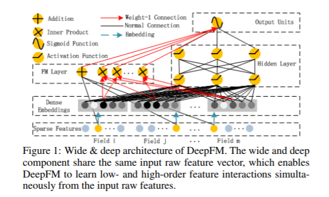
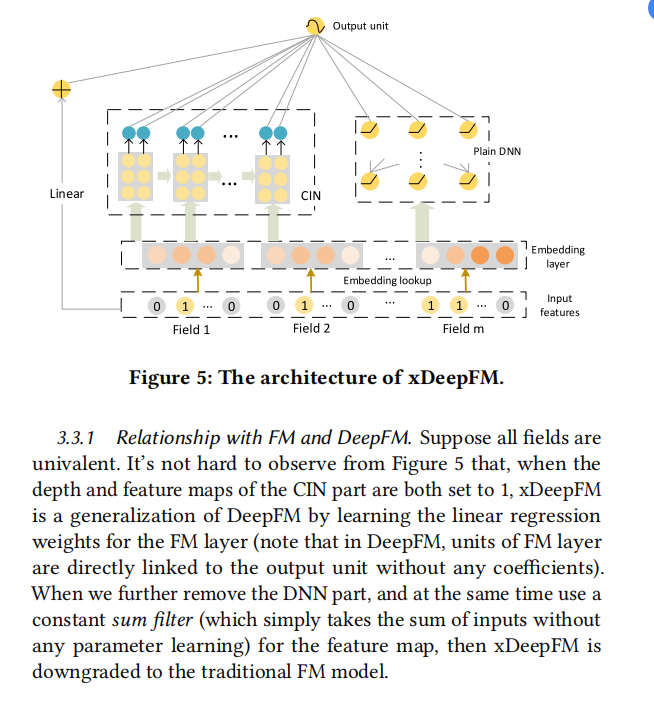
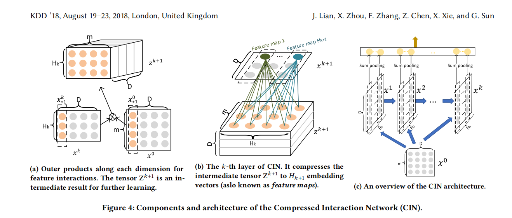

# ICME 2019短视频内容理解与推荐竞赛总结

## 比赛介绍


### 比赛背景

参赛者需要通过一个视频及用户交互行为数据集对用户兴趣进行建模，然后预测该用户在另一视频数据集上的点击行为。通过构建深度学习模型，预测测试数据中每个用户id在对应作品id上是否浏览完作品和是否对作品点赞的概率加权结果。

分为两个赛道：赛道1和赛道2，分别是大规模数据集，亿级别的数据信息和小规模数据集，千万级别的数据信息，本次选择的是赛道2.

### 比赛数据集

本次竞赛提供多模态的短视频内容特征，包括视觉特征、文本特征和音频特征，同时提供了脱敏后的用户点击、喜爱、关注等交互行为数据。

本次比赛主要选择的交互数据，可能也是最后成绩有限的原因，应该对数据处理和如何应用raw data这一块多做功课。

## 模型说明

本次参赛过程主要涉及的模型包括FM模型、DeepFM模型和xDeepFM模型，下面对这几个模型的基本思想进行介绍。

### FM模型

该模型的主要思路是在进行预估时除了要考虑单个特征之外，还要考虑组合特征。一般需要对离散型的数据进行one-hot处理，导致产生一个高维的稀疏矩阵，FM模型的特征组合部分通过矩阵分解，引入隐向量，完成对特征的参数估计。

> 但是该模型的隐向量部分并未在本次比赛的mxnet版本代码中实现，主要原因是将数据one-hot处理之后，在通过数据index转换参数矩阵进行求解过程中，因为有一些操作导致模型网络在构建过程中网络断掉，mxnet的自动求导失效，从而导致模型未更新.

推荐阅读博客[FM算法解读](!http://www.cnblogs.com/wkang/p/9588360.html)
关于如何处理隐向量问题也可以参考博客[隐向量](!https://www.cnblogs.com/wkang/p/9881921.html)


模型公式：

$$y(x) = w_{0} + \sum_{i=1}^nw_{i}x_{i}+\frac{1}{2} \sum_{f=1}^k((\sum_{i=1}^nv_{i,f}x_{i})^2-\sum_{i=1}^nv_{i,f}^2x_{i}^2)$$

具体的公式理解可以阅读上面推荐的博客

### DeepFM模型

DeepFM模型主要是讲FM模型与DNN(Deep Neural Network)进行结合，一般结合方式是串行和并行，该模型采取的方式是并行。
DeepFM模型结构如图所示：


[模型理解和代码解读参考](!https://www.cnblogs.com/wkang/p/9881921.html)

[代码主要参考](!https://github.com/shenweichen/DeepCTR)

#### 模型结构图解读：

1. FM层将sparse Features输入到order-1部分
2. FM层将embedding部分处理的数据执行Inner Product操作
3. embedding向量同时作为DNN部分的输入，这部分的模型输入完全由自己设计。

> DeepFM模型论文对超参数做了对比实验，得出的结论是：relu比tanh更适合深度模型，除了IPNN；dropout的概率设置在0.6-0.9比较合适；DeeFM模型的DNN部分每层神经元的个数设置在400-800比较合适，最终设置的参数要针对不同的数据集做相应的调整，不是绝对的。

#### 实现思路：

1. FM部分的linear操作直接将raw features和参数矩阵相乘；

2. FM层的embedding处理特征的步骤：首先，对于每个连续性特征，输入到dense层，dense的输出神经元个数设置为embedding_size的大小比如某个连续型特征维度是（batch_size,1）输出维度为（batch_size,embedding_size）再进行reshape成（batch_size,1,embedding_size），对于离散型特征，输入到embedding层，embedding层的离散输入个数是对应离散型特征的离散值个数，输出神经元个数为embedding_size的大小，对某个离散型特征输出维度为（batch_size,1,embedding_size）.然后对于连续性和离散型数据处理后的特征对第2个维度进行concat，形成（batch_size,field_num,embedding_size）维度的数据。将该数据当作order-2部分的数据执行Inner Product部分的计算，同时也作为DNN部分的输入/

3. DNN部分的设计就是凭感觉了，Dense\BatchNorm\Activation\dropout，凭感觉加，dropout一般看模型是否有过拟合来设计丢弃的概率。比赛的数据集在like上面的预测效果比较好，但是在finish预测上非常容易出现过拟合

4. 最后将Linear、Inner Product和DNN部分的输出相加输入到Sigmoid中，Sigmoid将结果映射到0-1区间，用来表示概率


### xDeepFM模型

在我看来xDeepFM模型与FM模型并没有什么关系，从论文的网络结构图中看出，网络的输出层的输入是由Linear、CIN网络输出和DNN网络输出构成，Linear部分和DNN的操作和DeepFM相同，而CIN网络主要是为了组合特征，学习Cross Network的思想，进行设计。
xDeepFM模型结构如图所示：

CIN网络的部分看论文的网络结构比较复杂，直接看的DeepCTR的源码，然后翻译成mxnet写的，自己写的模型性能和准确度上面可能不如源码的，在一个epoch，服务器上源码跑几分钟到十几分钟，自己的模型大概需要20-40分钟。

CIN网络结构如图所示：

重点说下CIN网络的设计思路，其他方面同DeepFM模型：


大体的思路是对于每一个样本的每一个embedding维度的向量进行 $$\otimes$$ 运算，比如,x1是由 x0做 $$\otimes$$ 运算得到的，x0的第一个样本的第一个embedding向量（fieldnum,1）和x0的第一个样本的第一个embedding向量的转置（1，fieldnum）做运算(4-a)，得到一个（fieldnum,fieldnum）维度的矩阵，最后得到的矩阵维度是(embeddingsize,batchsize,fieldnum,fieldnum),经过reshape和transpose之后得到(batchsize,fieldnum$$*$$fieldnum,embeddingsize)维度的向量，输入到conv1d中（4-b）进行卷积运算，通道是fieldnum*fieldnum，kernel是1，最后输出的矩阵大小为（batchsize,layersize,embeddingsize）即为x1,同样地，x1和x0进行同样的运算得到x2,将这些x进行concat（4-c）,再经过dense输出。

将embedding部分，dnn部分和cin网络部分的数据相加，经过sigmoid映射到0-1之间作为预测概率作为模型的输出。

## 代码解析

### 模型common部分

#### 模型初始化

```
class SingleFeat:
    def __init__(self,feat,num):
        self.feat_name = feat # 特征名字
        self.feat_num = num # 特征个数
```

核心在于模型初始化时输入一个特征字典，`{"sparse":[SingleFeat],"dense":[SingleFeat]}`key分别为sparse和dense，value为类型为SingleFeat的列表，对于离散型变量，featNum为改离散型变量的离散数目，用于初始化embedding层。
```
    def __init__(self, feature_dict, args, ctx, task,**kwargs):
		self.embedding_dict = OrderedDict()
        self.dense_dict = OrderedDict()
		with self.name_scope():
			for feat in feature_dict['sparse']:
				self.embedding_dict[feat.feat_name] = nn.Embedding(feat.feat_num, self.embedding_size)
				self.register_child(self.embedding_dict[feat.feat_name])
			for feat in feature_dict['dense']:
				self.dense_dict[feat.feat_name] = nn.Dense(self.embedding_size)
				self.register_child(self.dense_dict[feat.feat_name])
```

DeepFM模型和xDeepFM模型共用的数据处理部分代码，利用Embedding层代替one-hot处理离散型特征，利用Dense层处理连续性变量，使得最后连续性和离散型的数据输出shape相同:
```
    def get_embedding_array(self,input_sample):
        y = nd.zeros(shape=(input_sample.shape[0], 1, self.embedding_size),ctx=self.ctx)
        for single_feat in self.feature_dict['sparse']:
            x = input_sample[:, single_feat.feat_name].reshape((-1,1))
            y1 = self.embedding_dict[single_feat.feat_name](x) #b,1,e
            y = nd.concat(y, y1, dim=1) # b,n+1,e
        return y[:, 1:]#b,n,e

    def get_dense_array(self,input_sample):
        y = nd.zeros(shape=(input_sample.shape[0],1,self.embedding_size),ctx=self.ctx)
        for single_feat in self.feature_dict['dense']:
            x = input_sample[:, single_feat.feat_name].reshape((-1,1))
            y1 = self.dense_dict[single_feat.feat_name](x).reshape((-1,1,self.embedding_size))
            y = nd.concat(y,y1,dim=1) # b,n+1,e
        return y[:,1:]
```

DeepFM模型和xDeepFM模型共用的线性部分的操作
```
    def get_linear_dense_input(self, input_sample):
        y = nd.zeros(shape=(input_sample.shape[0], 1), ctx=self.ctx)
        for single_feat in self.feature_dict['dense']:
            x = input_sample[:, single_feat.feat_name].reshape((-1,1))
            y = nd.concat(y,x,dim=1)
        return y[:, 1:]

    def get_linear_logit(self,embedding_part_sparse,dense_input):
        embedding_part_sparse = embedding_part_sparse.sum(axis=1).sum(axis=1).reshape((-1,1))
        net = nn.Sequential()
        net.add(self.linear_logit_dense)
        net.add(self.linear_logit_bn)
        dense_linear_output = net(dense_input)
        net_embedding = nn.Sequential()
        net_embedding.add(self.linear_logit_embedding_bn)
        embedding_part_sparse = net_embedding(embedding_part_sparse)
        return embedding_part_sparse + dense_linear_output.reshape(embedding_part_sparse.shape)
```

### DeepFM模型

DeepFM网络结构
```
    def forward(self, input_sample):
        embedding_part_sparse = self.get_embedding_array(input_sample) #(?,n1,e)
        linear_dense_input = self.get_linear_dense_input(input_sample)
        linear_logit = self.get_linear_logit(embedding_part_sparse,linear_dense_input)
        dense_part_dense = self.get_dense_array(input_sample) # (?,n2,e)
        merge_sparse_dense = nd.concat(embedding_part_sparse,dense_part_dense,dim=1) # ?,f,e
        xv = nd.broadcast_mul(merge_sparse_dense,self.params.get('v').data())
        fm_embedding_part = nd.square(xv.sum(axis=1)) - nd.square(xv).sum(axis=1)
        fm_embedding_part = fm_embedding_part.sum(axis=1).reshape((-1,1)) / 2 # (?,1)
        net_embedding = nn.Sequential()
        net_embedding.add(self.bn_embedding)
        fm_embedding_part = net_embedding(fm_embedding_part)
        deep_input = merge_sparse_dense.flatten() # ?,f*e
        net = nn.Sequential()
        for i in range(len(self.dense_list)):
            net.add(self.dense_list[i])
            net.add(self.bn_list[i])
            net.add(self.activation_list[i])
            net.add(self.dropout_list[i])
        net.add(self.dnn_out)
        deep_output = net(deep_input)
        deep_fm = nd.sigmoid(linear_logit + fm_embedding_part + deep_output)
        return deep_fm
```

### xDeepFM模型

CIN网络结构
```
    def matmul(self, x, y, transpose_a=False,transpose_b=False):
        batch = x.shape[0]#batch
        m = x.shape[1]#field
        h_k = y.shape[1]
        x = nd.split(x, self.embedding_size, 2)
        y = nd.split(y, self.embedding_size, 2)
        res = nd.zeros(shape=(1,batch,m,h_k),ctx=self.ctx)
        for idx in range(self.embedding_size):
            array = nd.batch_dot(x[idx], y[idx], transpose_a,transpose_b=transpose_b).reshape((1,-1,m,h_k))
            res = nd.concat(res,array,dim=0) # embedding+1,batch,field,field
        return res[1:,:,:,:]

	def cin(self,X):
        batch = X.shape[0]
        hidden_nn_layers = [X]
        split_tensor0 = hidden_nn_layers[0]
        final_result = nd.arange(batch *self.embedding_size,ctx=self.ctx).reshape((batch,1,self.embedding_size))
        for idx,layer_size in enumerate(self.layer_size):
            # time_start = time.time()
            split_tensor = hidden_nn_layers[-1]
            dot_result_m = self.matmul(split_tensor0, split_tensor, transpose_b=True)
            dot_result_o = dot_result_m.reshape((self.embedding_size, -1, self.field_nums[0] * self.field_nums[idx]))
            dot_result = nd.transpose(dot_result_o, axes=(1, 0, 2))
            dot_result = nd.transpose(dot_result,axes=(0, 2, 1))
            # print(dot_result.shape)
            net = nn.Sequential()
            net.add(self.conv_list[idx])
            curr_out = net(dot_result)
            final_result = nd.concat(final_result,curr_out,dim=1)
            hidden_nn_layers.append(curr_out)
        final_result = final_result[:,1:,:]
        result = final_result.sum(axis=2)
        net = nn.Sequential()
        net.add(self.cin_dense)
        net.add(self.cin_bn)
        result = net(result)
        return result
```

xDeepFM网络结构
```
    def forward(self, input_sample):
        embedding_part_sparse = self.get_embedding_array(input_sample) #(?,n1,e)
        linear_dense_input = self.get_linear_dense_input(input_sample)
        linear_logit = self.get_linear_logit(embedding_part_sparse,linear_dense_input)

        dense_part_dense = self.get_dense_array(input_sample) # (?,n2,e)
        merge_sparse_dense = nd.concat(embedding_part_sparse,dense_part_dense,dim=1) # ?,f,e
        deep_input = merge_sparse_dense.flatten() # ?,f*e

        cin_output = self.cin(merge_sparse_dense)
        net = nn.Sequential()
        for i in range(len(self.dense_list)):
            net.add(self.dense_list[i])
            net.add(self.bn_list[i])
            net.add(self.activation_list[i])
            net.add(self.dropout_list[i])
        net.add(self.dnn_out)
        deep_output = net(deep_input)
        deep_fm = nd.sigmoid(linear_logit + deep_output + cin_output)
        return deep_fm
```

## 经验教训

### 调参经验

1. 测试集的loss降低，验证机的loss仍然比较大或者上升，模型过拟合，可以用adam优化算法设置weight_decay参数，或者增加dropout
2. 过拟合的原因可能有数据集太小或者模型过于复杂，层数过多
3. 在模型训练过程中出现不收敛的现象时检测是否是因为梯度衰减或者梯度爆炸


### 其他经验
1. 当多次调参对结果的影响微乎其微的时候考虑一下模型的有效性，多打印一下模型的中间输出。
2. 对模型结构要深入理解之后再动手写代码，如果是多人写一份代码或者模型要多加探讨，避免模型理解错误，在模型理解一致的前提下进行分工写代码
